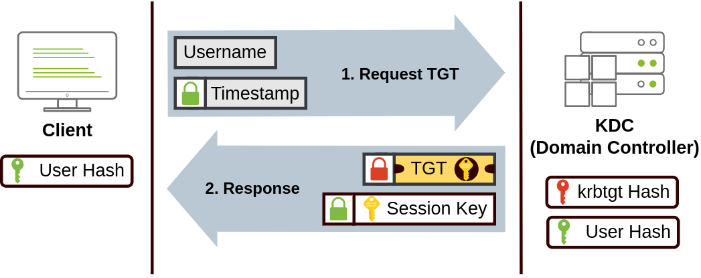
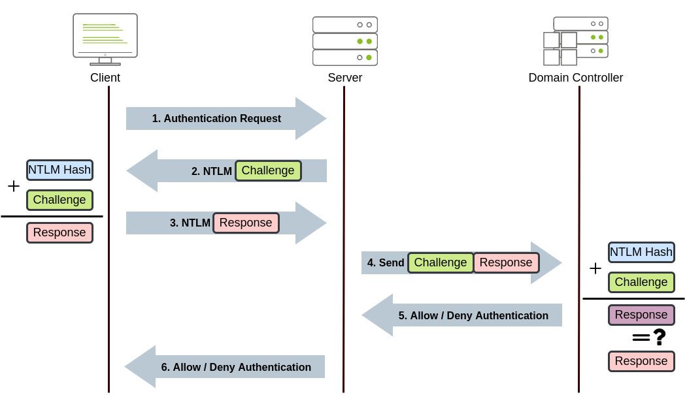

# Active Directory Basics 

[Walkthrough](https://medium.com/@kawsaruddin238/active-directory-basics-tryhackme-548e4cb6e7fb)

## Task 3: 

| Security Group       | Description                                                                                   |
|----------------------|-----------------------------------------------------------------------------------------------|
| Domain Admins        | Users of this group have administrative privileges over the entire domain. By default, they can administer any computer on the domain, including the DCs. |
| Server Operators     | Users in this group can administer Domain Controllers. They cannot change any administrative group memberships. |
| Backup Operators     | Users in this group are allowed to access any file, ignoring their permissions. They are used to perform backups of data on computers. |
| Account Operators    | Users in this group can create or modify other accounts in the domain.                       |
| Domain Users         | Includes all existing user accounts in the domain.                                            |
| Domain Computers     | Includes all existing computers in the domain.                                                |
| Domain Controllers   | Includes all existing DCs on the domain.                                                      |


Security Groups vs OUs

You are probably wondering why we have both groups and OUs. While both are used to classify users and computers, their purposes are entirely different:

- *OUs* are handy for applying policies to users and computers, which include specific configurations that pertain to sets of users depending on their particular role in the enterprise. Remember, a user can only be a member of a single OU at a time, as it wouldn't make sense to try to apply two different sets of policies to a single user.
- *Security Groups*, on the other hand, are used to grant permissions over resources. For example, you will use groups if you want to allow some users to access a shared folder or network printer. A user can be a part of many groups, which is needed to grant access to multiple resources.


### Password Reset

Change the password for user Sophie
```powershell 
Set-ADAccountPassword sophie -Reset -NewPassword (Read-Host -AsSecureString -Prompt 'New Password') -Verbose
```

Force user to change the password at login.
```powershell
Set-ADUser -ChangePasswordAtLogon $true -Identity sophie -Verbose
```

## Task 6:

Let's change the minimum password length policy to require users to have at least 10 characters in their passwords. To do this, right-click the GPO and select Edit. This will open a new window where we can navigate and edit all the available configurations. To change the minimum password length, go to Computer Configurations -> Policies -> Windows Setting -> Security Settings -> Account Policies -> Password Policy and change the required policy value.

GPOs are distributed to the network via a network share called SYSVOL, which is stored in the DC. All users in a domain should typically have access to this share over the network to sync their GPOs periodically. The SYSVOL share points by default to the C:\Windows\SYSVOL\sysvol\ directory on each of the DCs in our network.

Once a change has been made to any GPOs, it might take up to 2 hours for computers to catch up. If you want to force any particular computer to sync its GPOs immediately, you can always run the following command on the desired computer:


```powershell
gpupdate /force
```

## Task 7: 

### Kerberos Authentication:

When Kerberos is used for authentication, the following process happens:

1. The user sends their username and a timestamp encrypted using a key derived from their password to the Key Distribution Center (KDC), a service usually installed on the Domain Controller in charge of creating Kerberos tickets on the network.

The KDC will create and send back a Ticket Granting Ticket (TGT), which will allow the user to request additional tickets to access specific services. The need for a ticket to get more tickets may sound a bit weird, but it allows users to request service tickets without passing their credentials every time they want to connect to a service. Along with the TGT, a Session Key is given to the user, which they will need to generate the following requests.

Notice the TGT is encrypted using the krbtgt account's password hash, and therefore the user can't access its contents. It is essential to know that the encrypted TGT includes a copy of the Session Key as part of its contents, and the KDC has no need to store the Session Key as it can recover a copy by decrypting the TGT if needed.




2. When a user wants to connect to a service on the network like a share, website or database, they will use their TGT to ask the KDC for a Ticket Granting Service (TGS). TGS are tickets that allow connection only to the specific service they were created for. To request a TGS, the user will send their username and a timestamp encrypted using the Session Key, along with the TGT and a Service Principal Name (SPN), which indicates the service and server name we intend to access.

As a result, the KDC will send us a TGS along with a Service Session Key, which we will need to authenticate to the service we want to access. The TGS is encrypted using a key derived from the Service Owner Hash. The Service Owner is the user or machine account that the service runs under. The TGS contains a copy of the Service Session Key on its encrypted contents so that the Service Owner can access it by decrypting the TGS.


3. The TGS can then be sent to the desired service to authenticate and establish a connection. The service will use its configured account's password hash to decrypt the TGS and validate the Service Session Key.


### NetNTLM Authentication

NetNTLM works using a challenge-response mechanism. The entire process is as follows:



1. The client sends an authentication request to the server they want to access.
2. The server generates a random number and sends it as a challenge to the client.
3. The client combines their NTLM password hash with the challenge (and other known data) to generate a response to the challenge and sends it back to the server for verification.
4. The server forwards the challenge and the response to the Domain Controller for verification.
5. The domain controller uses the challenge to recalculate the response and compares it to the original response sent by the client. If they both match, the client is authenticated; otherwise, access is denied. The authentication result is sent back to the server.
6. The server forwards the authentication result to the client.

Note that the user's password (or hash) is never transmitted through the network for security.

**Note:** The described process applies when using a domain account. If a local account is used, the server can verify the response to the challenge itself without requiring interaction with the domain controller since it has the password hash stored locally on its SAM.


